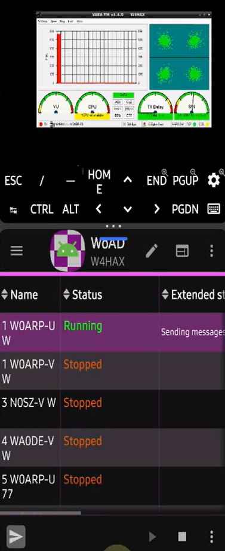

# VaraDROIDfm
Run VARA FM under Wine on Android/Termux with DigiRig USB audio and PTT, providing automated startup, diagnostics, recovery, and WoAD/VARA TCP integration.



## Demonstration

[Watch the VaraDROIDfm / WoAD demonstration](VaraDROIDfm-20260824_1840_05.mp4)

The demonstrated production configuration successfully provides **full bidirectional WoAD messaging over VARA FM**, including DigiRig USB audio, RTS/PTT, RF connection establishment, message transmission, and message reception.

This project documents and automates an Android-based VARA FM
environment designed for packet-radio applications such as **WoAD**. It
combines the compatibility, USB, audio, PTT, networking, startup,
diagnostic, and recovery components needed to operate VARA FM with
actual radio hardware.

------------------------------------------------------------------------

## Overview

VARA FM is a Windows application. Running it on an ARM64 Android device
requires several compatibility and hardware-integration layers:

``` text
Android
├── Termux
│   ├── Ubuntu
│   │   ├── Box64
│   │   ├── Wine
│   │   └── VARA FM
│   ├── Termux:X11 / Openbox
│   ├── PulseAudio
│   ├── DigiRig USB Audio
│   │   ├── RX audio → VARA FM
│   │   └── VARA FM TX audio → Radio
│   └── DigiRig CP210x
│       └── RTS → PTT
└── WoAD
    ├── VARA command port 8300
    └── VARA data port 8301
```

The goal is not simply to launch VARA FM under Wine. The project
provides the supporting infrastructure required to make VARA useful with
a radio:

-   USB audio
-   PTT control
-   COM-port emulation
-   TCP command and data interfaces
-   Automated startup and shutdown
-   Health checks and diagnostics
-   Known-good recovery checkpoints
-   Protocol capture and troubleshooting

------------------------------------------------------------------------

## Project Goals

-   Run VARA FM under Wine on an ARM64 Android device.
-   Display the VARA FM GUI through Termux:X11.
-   Route DigiRig receive audio into VARA FM.
-   Route VARA FM transmit audio back through the DigiRig.
-   Control radio PTT through the DigiRig CP210x RTS signal.
-   Emulate the COM interface expected by VARA FM.
-   Expose VARA's TCP command and data interfaces.
-   Support Android applications such as WoAD.
-   Provide deterministic cold-start and shutdown procedures.
-   Detect failed components before attempting radio operation.
-   Preserve known-good configurations and recovery checkpoints.
-   Provide detailed diagnostics for Wine, Box64, PulseAudio, USB, TCP,
    X11, and VARA.

------------------------------------------------------------------------

## Architecture

### VARA FM Runtime

VARA FM executes as a 32-bit Windows application inside Wine 11.14 New WoW64. On the ARM64 Android target, **Box64** translates the x86-64 Wine components while **WowBox64** provides execution of the 32-bit x86 VARA FM code used by Wine's New WoW64 path. This distinction became important during compatibility testing because not every Box64 DynaRec option is applicable to WowBox64.

``` text
VARAFM.exe
    ↓
Wine
    ↓
Box64
    ↓
Ubuntu / Termux
    ↓
Android
```

### Graphical Environment

VARA's Windows GUI is displayed through:

``` text
VARA FM
   ↓
Wine
   ↓
X11
   ↓
Termux:X11
```

**Openbox** provides lightweight window management.

------------------------------------------------------------------------

## Audio

The DigiRig USB audio interface appears as a C-Media USB audio device.
The project uses a Termux USB bridge to acquire DigiRig audio and
deliver it into the audio environment used by Wine.

### Receive Path

``` text
Radio
  ↓
DigiRig
  ↓
USB C-Media Audio
  ↓
Termux USB Bridge
  ↓
FIFO
  ↓
PulseAudio Source
  ↓
Wine waveIn
  ↓
VARA FM
```

### Transmit Path

Transmit audio follows the corresponding path from VARA FM through Wine
and PulseAudio back to the DigiRig and radio.

------------------------------------------------------------------------

## PTT Control

PTT is controlled through the DigiRig's CP210x USB serial interface.

VARA operates against a Windows-style COM port. The project translates
VARA's RTS state into DigiRig PTT control:

``` text
VARA FM
   ↓
COM1 / RTS
   ↓
Wine
   ↓
PTY / socat
   ↓
RTS Watcher
   ↓
Termux USB
   ↓
CP210x
   ↓
DigiRig PTT
   ↓
Radio
```

This allows VARA FM to control radio transmit state without requiring
native Android serial-port support inside Wine.

------------------------------------------------------------------------

## VARA TCP Interface

VARA FM exposes two primary TCP interfaces:

      Port Function
  -------- -----------------------------
    `8300` Command / control interface
    `8301` Data interface

Example command traffic:

``` text
MYCALL W4HAX<CR>
PUBLIC ON<CR>
LISTEN OFF<CR>
CONNECT W4HAX W0ARP-10<CR>
DISCONNECT<CR>
```

The project includes diagnostic methods for examining the protocol
directly, including raw ASCII and hexadecimal captures.

This helps isolate problems involving:

-   WoAD
-   VARA FM
-   Wine
-   Box64
-   TCP proxying
-   Command framing
-   Socket initialization
-   Modem state

------------------------------------------------------------------------

## WoAD Integration

**WoAD running natively on Android has now been validated end-to-end with VARA FM running inside the Termux/Wine environment.**

``` text
WoAD
 ├── TCP 8300 ── Command ──┐
 └── TCP 8301 ── Data ─────┤
                           ↓
                        VARA FM
                           ↓
                        DigiRig
                           ↓
                         Radio
```

A diagnostic TCP proxy can also be inserted between WoAD and VARA:

``` text
WoAD
  ↓
Diagnostic TCP Proxy
  ↓
VARA FM
```

This permits exact capture of commands and responses without modifying
WoAD or VARA FM.

------------------------------------------------------------------------

## Startup Automation

VARA FM depends on several services being initialized in the correct
order.

The startup system manages:

1.  **Termux:X11 and Openbox**
2.  **Runtime directories and FIFOs**
3.  **PulseAudio**
4.  **DigiRig audio sources and sinks**
5.  **PulseAudio TCP transport**
6.  **Wine and VARA FM**
7.  **DigiRig USB audio acquisition**
8.  **COM1 / PTY mapping**
9.  **RTS / PTT monitoring**

The project includes automated startup and shutdown procedures rather
than requiring every component to be launched manually.

Health checks are used to detect partially initialized environments
before radio operation begins.

------------------------------------------------------------------------

## Diagnostics

A major focus of the project is **reproducibility**.

Diagnostic tools can capture the state of:

-   Android / Termux processes
-   Ubuntu processes
-   Wine and wineserver
-   Box64
-   VARA FM
-   X11 and Openbox
-   PulseAudio
-   Audio sources and sinks
-   USB devices
-   DigiRig audio
-   DigiRig serial / PTT
-   FIFOs and PTYs
-   COM mappings
-   TCP listeners and connections
-   VARA command traffic
-   VARA logs
-   Wine registry state
-   Application configuration
-   Runtime directories

Diagnostic runs generate timestamped logs that can be retained and
compared between working and failing states.

------------------------------------------------------------------------

## Known-Good Checkpoints

The project uses recovery checkpoints rather than assuming a working
configuration can always be reconstructed manually.

A verified operating state includes:

``` text
VARA FM launches
        ↓
X11 GUI works
        ↓
DigiRig RX audio reaches VARA
        ↓
VARA TX audio reaches DigiRig
        ↓
COM1 mapping works
        ↓
RTS controls PTT
        ↓
Radio transmits
        ↓
Radio receive audio returns to VARA
```

Once a complete state is verified, important scripts and configuration
are preserved.

This makes regression testing possible when Android, Termux, Wine,
Box64, USB handling, or startup automation changes.

------------------------------------------------------------------------

## Development and Testing

Troubleshooting uses numbered tests and controlled A/B comparisons.

``` text
Known-Good State
       ↓
Change One Variable
       ↓
Run Controlled Test
       ↓
Capture Complete Output
       ↓
Compare Results
       ↓
Accept or Reject Hypothesis
```

Testing has included:

-   Direct raw TCP connections
-   Command/data socket ordering
-   Command framing
-   TCP proxies
-   External WoAD connections
-   Native Windows control testing
-   Wine/Android comparisons
-   VARA configuration comparisons
-   Wine registry comparisons
-   MMDevices audio-state testing
-   Box64/Wine runtime provenance
-   Process and socket-state analysis

------------------------------------------------------------------------


## Ubuntu 26 x86-64 Control Testing

A separate **Ubuntu 26 Hyper-V x86-64 VM** was used as an architectural control environment. The purpose was not to reproduce the Android hardware stack, but to remove ARM64 translation from the VARA/Wine execution path.

``` text
Ubuntu 26 x86-64 VM
       ↓
Wine / VARA FM
       ↓
No ARM64 Box64/WowBox64 translation
```

The x86-64 control helped narrow the Android-specific command-processing problem away from VARA command syntax itself and toward the ARM64 translation layer. This led to the focused **300A Box64/WowBox64 test series**.

------------------------------------------------------------------------

## 300A Box64 / WowBox64 Investigation

A key compatibility defect appeared on the Android ARM64 environment: argument-bearing VARA commands such as:

``` text
MYCALL W4HAX<CR>
```

were received by VARA but returned:

``` text
WRONG<CR>
```

The same command was valid in control environments. Testing therefore focused on DynaRec behavior while keeping the surrounding Android/Termux/Wine/VARA environment constant.

The controlled results included:

| Configuration | `MYCALL W4HAX` |
| --- | --- |
| Default DynaRec / SAFEFLAGS=1 | `WRONG` |
| `BOX64_DYNAREC_SAFEFLAGS=0` | `WRONG` |
| `BOX64_DYNAREC_STRONGMEM=1` | `WRONG` |
| DynaRec disabled | `OK` |
| Conservative Box64 profile | `OK` |
| **`BOX64_DYNAREC_SAFEFLAGS=2`** | **`OK`** |

The minimal production correction was therefore:

``` bash
export BOX64_DYNAREC_SAFEFLAGS=2
```

This retained DynaRec performance while correcting VARA's command handling. The setting was promoted into production `ss-5`, followed by validation of normal GUI rendering, tone generation, `MYCALL`, DigiRig PTT, TX/RX audio, and WoAD operation.

The investigation also demonstrated why Box64 and WowBox64 must be considered separately: VARA FM is 32-bit, so a setting must actually apply to the 32-bit New WoW64 execution path to be meaningful to this application.

------------------------------------------------------------------------

## Native Windows Control Testing

Native Windows VARA FM is used as a control environment when
investigating compatibility problems.

The same raw command can be compared between:

``` text
Windows 11 → VARA FM
```

and:

``` text
Android → Termux → Ubuntu → Box64 → Wine → VARA FM
```

For example, native Windows has successfully processed:

``` text
MYCALL W4HAX<CR>
```

and returned:

``` text
OK<CR>
```

This methodology helps separate protocol behavior from radio hardware
behavior and identify differences introduced by the Wine/ARM64
environment.

------------------------------------------------------------------------

## Hardware

Development and testing have primarily used:

-   Galaxy S25 ARM64 Android device
-   DigiRig Mobile USB-C interface with Silicon Labs CP210x serial and audio interfaces
-   Baofeng DM32-UV VHF/UHF radio

USB audio and serial/PTT are handled independently, allowing each path
to be tested without assuming the other is operational.

------------------------------------------------------------------------

## Recovery and Isolation

Experimental environments should remain isolated from known-good
installations.

Avoid sharing mutable resources such as:

-   Wine prefixes
-   VARA configuration files
-   FIFOs
-   Sockets
-   Runtime directories
-   COM mappings
-   PulseAudio configuration
-   Helper scripts with writable state

A separate experimental environment allows new Wine, Box64, VARA, or
startup configurations to be tested without jeopardizing a known-good
radio installation.

------------------------------------------------------------------------

## Validated End-to-End Path

The completed production configuration has successfully exercised the complete path:

``` text
WoAD (Android)
   ↓ TCP command/data
VARA FM
   ↓ Wine 11.14 New WoW64
Box64 / WowBox64 (SAFEFLAGS=2)
   ↓
PulseAudio + USB bridges
   ↓
DigiRig audio + CP210x RTS/PTT
   ↓
VHF/UHF radio
   ↓ RF
Remote VARA station / Winlink path
   ↓
Bidirectional message transfer
```

During final validation, two unrelated physical-layer problems were also isolated. An intermittent USB audio loss was traced to a **bad USB-C cable**, and the remaining marginal RF/session behavior was resolved by an **antenna swap**. These were kept separate from the Box64 compatibility diagnosis.

The resulting full-stack known-good state was preserved as checkpoint:

``` text
300B009-20260824_0058-WOAD-VARA-FULL-KNOWN-GOOD.tar
```

------------------------------------------------------------------------

## Project Status

The project has demonstrated the major components required for VARA FM
operation on Android, including:

-   [x] VARA FM execution under Wine/Box64
-   [x] Termux:X11 GUI operation
-   [x] DigiRig USB integration
-   [x] Receive audio into VARA
-   [x] Transmit audio from VARA
-   [x] RTS-based PTT
-   [x] COM1 emulation
-   [x] VARA TCP command access
-   [x] VARA TCP data access
-   [x] Direct protocol testing
-   [x] TCP proxy/capture operation
-   [x] WoAD-to-VARA connectivity testing
-   [x] WoAD RF connection establishment
-   [x] WoAD message transmission
-   [x] WoAD message reception
-   [x] Full bidirectional end-to-end WoAD/VARA FM operation
-   [x] Ubuntu 26 x86-64 architectural control testing
-   [x] Box64/WowBox64 DynaRec isolation and SAFEFLAGS=2 production fix
-   [x] Automated startup and diagnostics
-   [x] Known-good recovery checkpoints

The full production path has now been demonstrated with **successful WoAD message transmission and reception over RF**. Development can therefore focus on reliability, packaging, startup simplification, and regression testing rather than basic feasibility.

------------------------------------------------------------------------

## Intended Audience

This repository is intended primarily for amateur-radio operators and
technical experimenters interested in:

-   VARA FM
-   Android packet radio
-   WoAD
-   DigiRig
-   Wine on ARM64
-   Termux
-   Termux:X11
-   USB audio on Android
-   Software-defined TNC/modem integration
-   Amateur-radio protocol experimentation

The project also aims to provide enough diagnostic information for
failures to be reproduced and investigated rather than treated as
unexplained compatibility problems.

------------------------------------------------------------------------

## Disclaimer

This is an experimental integration project involving Android, Termux,
Wine, Box64, USB hardware, and amateur-radio equipment.

Behavior may vary across Android versions, devices, Wine/Box64 builds,
DigiRig interfaces, radios, and VARA FM releases.

Operators are responsible for configuring and operating their stations
in accordance with applicable amateur-radio regulations and licensing
requirements.
